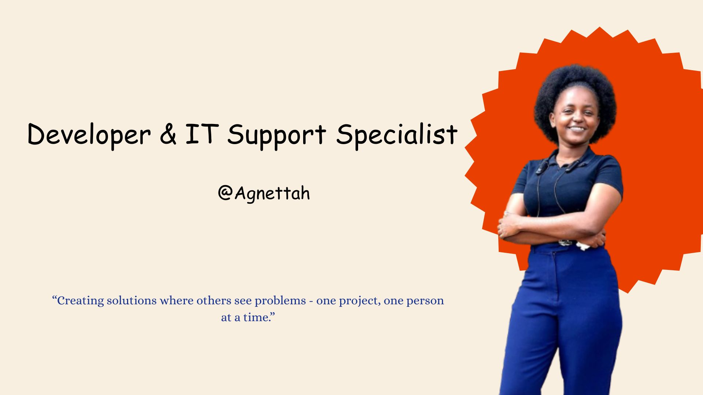

# Hi there, I'm Agnettah! 👋🏽

## About Me 🚀

I'm a Software Engineer with a background in IT support and a passion for frontend development, digital problem-solving, and creative expression. I enjoy building clean, user-centered web experiences and meaningful digital products—especially those that support emotional wellness.

Currently learning through the ALX Frontend Program and exploring ways to blend tech with purpose through projects like **Gentle Pages Co.** and **MineGuardPro**.

👨🏻‍💻 Always learning, always building—one solution at a time.

- 🌱 Currently Developing: A role based mining system, addressing key pain points in the industry.
- 🔭 Working on: SDLC for a supply chain addressing the mining sector
- 🎯 Projects: Created a presentation addressing issues in the Education sector # One-size-fits-none.
- ⚡ Fun fact: I love doing hard things 💃🏽 

## My Skills 🧠

JavaScript |
Supabase   | 
Springbot  |  
React       |
Python   |
Flutter   |
WordPress   |
Technical Support & Systems Thinking   |
Networking   |
Frontend Dev & UI Thinking |
Self-Driven Learning |
Growth Mindset  |

## 🌟 My Vision

### To be a walking solution—a tech-driven problem solver who blends creativity, compassion, and innovation to build digital tools that empower people, fill industry gaps, and inspire growth in everyday life.

## Get in Touch 📬

- [LinkedIn](https://www.linkedin.com/in/agnettah-waeni-a80484233/)
- [Gmail](agnettahwaeni5504@gmail.com)
- [Whatsapp](+254 716921591)
