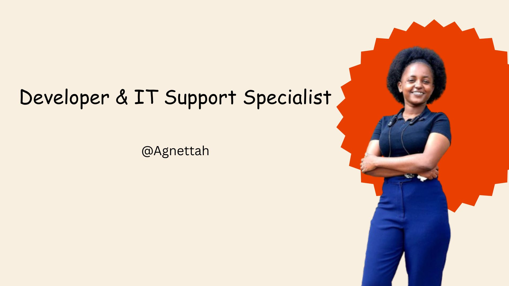

### Final readme file: 

# Hi there, I'm Agnettah! 👋🏽

## About Me 🚀

I'm a Software Engineer with a background in IT support and a passion for frontend development, digital problem-solving, and creative expression. I enjoy building clean, user-centered web experiences and meaningful digital products—especially those that support emotional wellness.

Currently learning through the ALX Frontend Program and exploring ways to blend tech with purpose through projects like **Gentle Pages Co.** and **MineGuardPro**.

👨🏻‍💻 Always learning, always building—one solution at a time.

- 🌱 Currently Developing: A role based mining system, addressing key pain points in the industry.
- 🔭 Working on: SDLC for a supply chain addressing the mining sector
- 🎯 Projects: Created a presentation addressing issues in the Education sector # One-size-fits-none.
- ⚡ Fun fact: I love doing hard things 💃🏽 

## My Skills 🧠

 
 
 
 
 

 📚

Demonstrate your proficiency at GitHub by becoming certified. This guide will help you prepare for the exams and provide you with resources to help you succeed.

## Get in Touch 📬

- [Personal Blog](https://itsthatlady.dev/ ) 
- [LinkedIn](https://twitter.com/itsthatladydev) 
- [Twitter](https://www.linkedin.com/in/kedashakerr/) 
